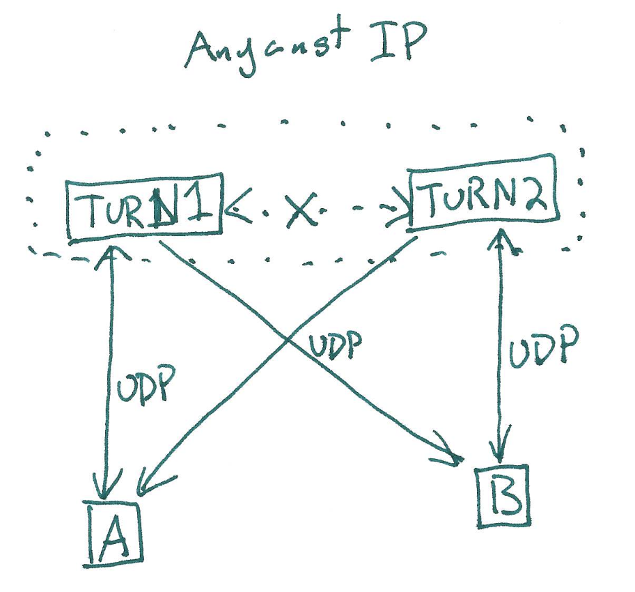
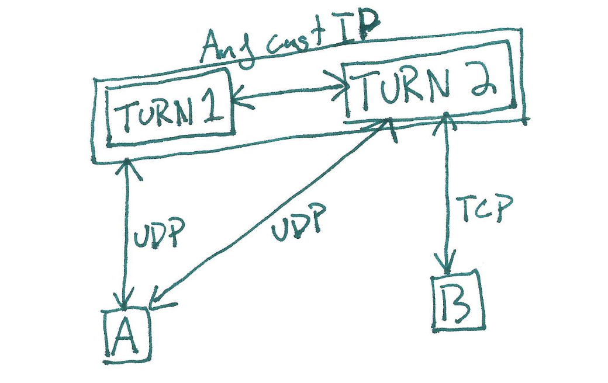

# turn-gateway
Binds to `\[::\]:3478/udp`, `\[::\]:3478/tcp`, and to a TUN interface.  Non-blocking, but single threaded.

This is a stateless (except for the `Slab<BuffWriter<TcpStream>>`) bridge between TURN frames and UDP datagrams on the TUN interface.  This service is intended to be horizontally scalable, however this would require all instances/sites to share a pair of IP(4|6) addresses.  TURN Data frames being forwarded over UDP can be emit by any instance, however TURN Data frames being relayed over TCP must be emitted by the correct server holding that TcpStream.  This should be possible by using a VPN between the instances and setting routing rules based on the IP subnets each instance uses for their TcpStream allocations

# hosted
Binds to `\[::\]:5000/sctp` and to a TUN interface.  Non-blocking, but single threaded.

This is server does several things:
1. It decrypts DTLS traffic sent to a range of ipaddresses+ports.  Since webbrowsers don't currently support DTLS CIDs, and since I think ICE is dogshit, we use the destination ip+port as a psuedo CID to allow sender mobility.  DTLS cookies are used to verify ownership of the sender's IP+Port, but I haven't added a limit to 1 DTLS context per source.
2. It emits the decrypted DTLS messages as SCTP packets on the TUN interface to the OS's SCTP stack.  Response SCTP packets are encrypted and relayed if they originate from our host IP.
3. SCTP connections are paired back up with their DTLS context and their client certificate is turned into the base62 identifiers that I use everywhere.
4. A WebRTC DataChannel is negotiated that allows the peer to send and receive raw IPv6 packets on an allocated address.
5. **TODO:** This server will act as a DNS server to map &lt;base62(sha256(certificate))&gt;.stun.evan-brass.net -> &lt;allocated IP&gt; so that clients can give out a consistent dyndns name for their address in the isolated stun.evan-brass.net network.

Hosted allows anyone with a webbrowser MITM access to their own WebRTC connections.  You could use this to detect incoming connections, pass data via the ICE ufrag, etc.
